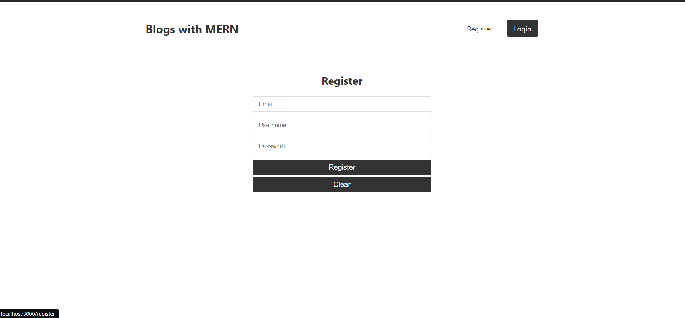

# Blogs

## Description

This project is a full-stack MERN (MongoDB, Express.js, React, Node.js) application designed for managing blogs. It includes features such as user authentication, CRUD (Create, Read, Update, Delete) operations for blog posts, and seamless navigation between different blogs.

## Overview

- **User Authentication**: Secure login and registration system, view & update profile.
- **CRUD Operations**: Create, read, update, and delete blog posts.
- **Blog Navigation**: Easy navigation through different blog posts.

## Features to implement

- Pop-ups effect with Toas
- Loading effect

## Technologies Used:

- **MongoDB**: For database management.
- **Express.js**: For building the backend API.
- **React**: For building the frontend user interface.
- **Node.js**: For running the backend server.
- **JSON Web Token**: For user sessions

## User

- Username: abdo
- Password: abdo

## Screenshots

### Home Page

### Authentication

### Profile

### Blogs list

### Blog operation

### API request Example

### Error Page

