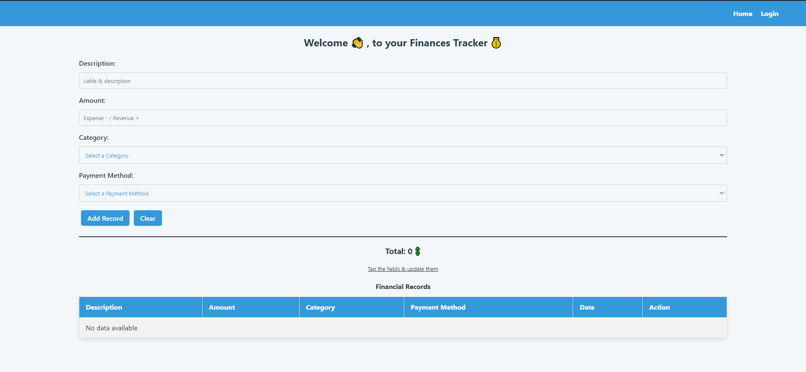
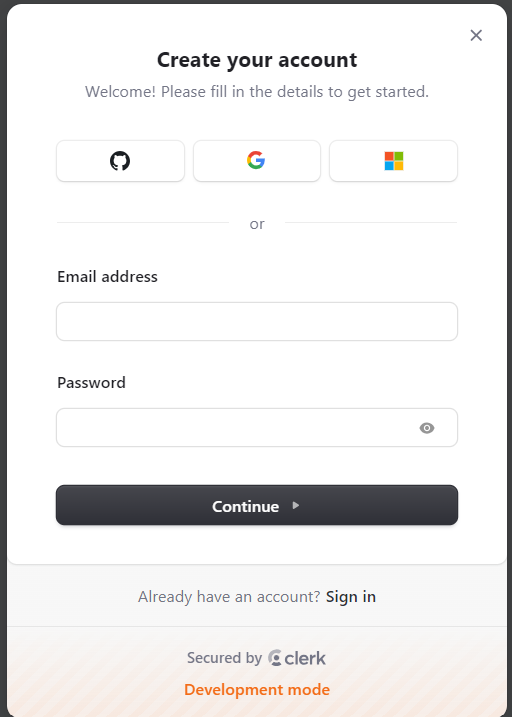
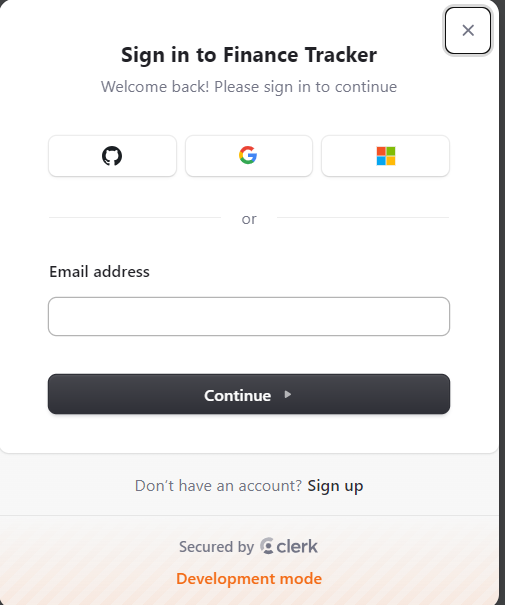
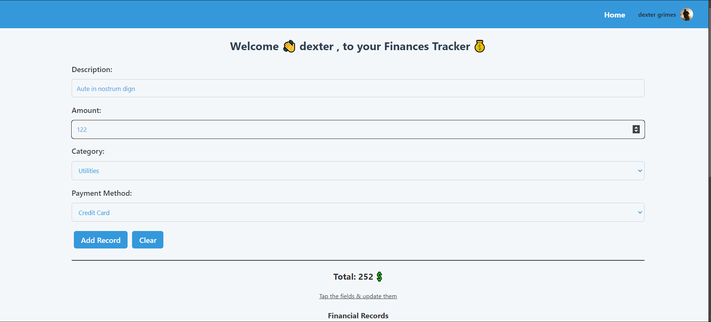
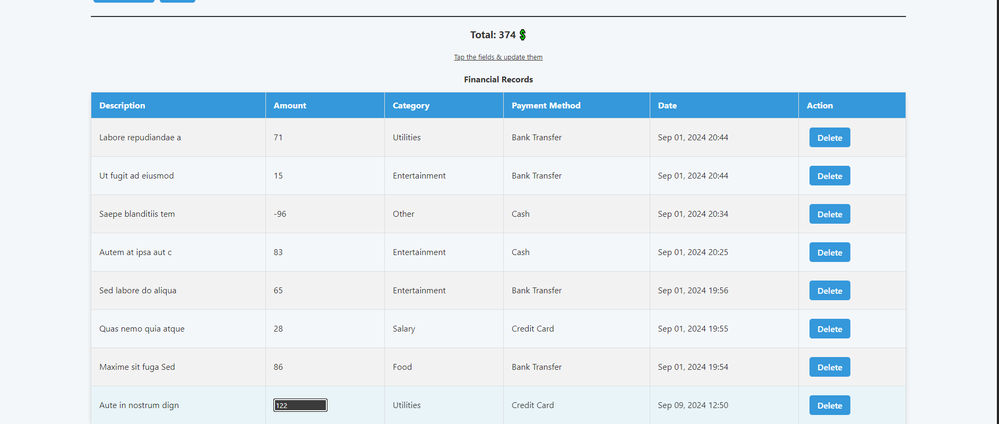

# Finance Tracker

MERN app to track your finances (Expenses - / Revenues +) with clerk authentication.

## Features

- Authentication using clerk with multiple options (Google, Github, Microsoft, Normal) Acount
- Add financial records
- View financial records
- Edit financial records
- Delete financial records

## Technologies Used

- React
- React Router
- Clerk
- MongoDB
- Mongoose
- Node.js
- Express.js

## Screenshots

### Home page

### Authentication

### Operations

