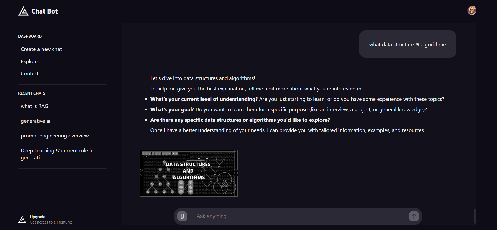

# Chat Bot

## Description

Fullstack MERN Application implementing a chatbot using the Google AI API 'Gemini'. The application utilizes the power of the 'Gemini-1.5-Flash' model along with other APIs for authentication and image upload.

## Features

- Authentication & Authorisations to api
- AI Questions & Answers
- Chat History

## Issue

- Image processing by the model

## Technologies

- Mongo Atlas
- Express
- React
- Node
- Vite
- Gemini API
- ImageKit
- Clerk Authentication

## ScreenShots

### Home page : click get started to authenticate

### Authentification

### Dashboard

### Chats

